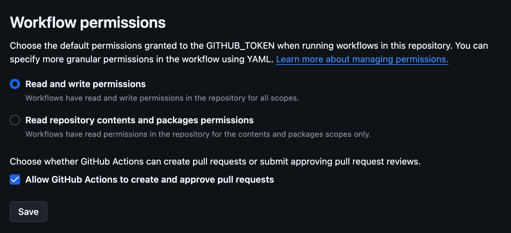

# archival-identifier 🧹🔍
[](https://github.com/DSACMS/archival-identifier/releases)


A GitHub Action to identify repositories that are candidates for archival based on development activity, usage, criticality score, and repository contents.

## About the Project
archival-identifier is a GitHub Action that scans a GitHub organization to identify repositories that are suitable candidates for archival. It uses 4 types of repository data/metrics groups as indicators for project health to determine whether a repository should be archived:

1. Development Activity Metrics
_Assessing repository activity based on how recently key actions occurred within certain period of time_

Metrics: Open issues, closed issues, open pull requests, merged/closed pull requests, releases, commits

2. Reuse via forks
_Analyzing forks and its activity helps us understand how often the project is being used by its downstream use and developer community_

Metrics: Number of forks, active forks

3. [OpenSSF Criticality Score](https://github.com/ossf/criticality_score)
_Developed by OpenSSF, criticality score represents the influence and importance of a project. Score is between 0 (least critical) to 1 (most critical)_

Metrics: Criticality Score

4. Repository contents
_Repositories that are empty and only contain a README with no plans for future development are suitable candidates for archival_

Metrics: Empty, README-only, Has Content

_To learn more on the specific metrics we use, visit the [How it Works section](#how-it-works)._

After fetching and calculating the data above, the action posts an issue to the repository containing the results along with a status determination for each repository. [Criteria for determination](https://dsacms.github.io/ospo-guide/outbound/archiving-repositories/#criteria-for-determination) can be found in the our [archiving repositories guide](https://dsacms.github.io/ospo-guide/outbound/archiving-repositories/).

The status determinations supported at this time are:
| Status | Description | Open PRs  | Merged/ Closed PRs | Push to repo | Push to forks | Open issues | Closed issues | Criticality Score | Is repo empty/ README only? | 
| :---- | :---- | :---- | :---- | :---- | :---- | :---- | :---- | :---- | :---- |
| Active | This project is under active development and has an active user base | ✅  | ✅ | ✅ | ✅ | ✅ | ✅ | Above $THRESHOLD \_SCORE | Has content |
| Dormant | Project upstream and downstreams are inactive | ❌ | ❌ | ❌ | ❌ | ❌ | ❌ | ❌ Below $THRESHOLD \_SCORE | Empty OR README-only |

This project is developed by the CMS.gov Open Source Program Office, based on our [archiving repositories guide](https://dsacms.github.io/ospo-guide/outbound/archiving-repositories/) and the [CHAOSS Practitioner Guide for Sunsetting Open Source Projects](https://chaoss.community/practitioner-guide-sunset/).

### Usage
Create a new GitHub workflow file (e.g., `.github/workflows/archival-identifier.yml`) or add the following to an existing GitHub Actions workflow:

```
name: Identify repositories for archival
on:
  workflow_dispatch:
    inputs:
      start_date:
        description: 'Start date for historical data (YYYY-MM-DD) - required, e.g., 2026-01-01'
        required: true
        type: string
      end_date:
        description: 'End date for historical data (YYYY-MM-DD) - defaults to today if not provided'
        required: false
        default: ''
        type: string
      org_name:
        description: 'GitHub organization name'
        required: true
      visibility:
        description: 'Which repos to scan: all, public, or private'
        required: true
        default: 'all'
        type: choice
        options:
          - all
          - public
          - private

permissions:
  contents: write
  pull-requests: write
  issues: write

jobs:
  run-archival-identifier:
    runs-on: ubuntu-latest
    steps:
      - name: Checkout Repository
        uses: actions/checkout@v6
        with:
          fetch-depth: 0
      - name: Run archival-identifier
        id: archive
        uses: DSACMS/archival-identifier@main
        with:
          ORG_NAME: ${{ inputs.org_name }}
          VISIBILITY: ${{ inputs.visibility }}
          START_DATE: ${{ inputs.start_date }}
          END_DATE: ${{ inputs.end_date }}
          GITHUB_ORG_TOKEN: ${{ secrets.GITHUB_TOKEN }}
```

### How it works

#### Activity Development Metrics
The action uses [super-changelog](https://www.github.com/DSACMS/super-changelog) to fetch development activity metrics on all repositories within a defined timeframe. It returns the following data: open/closed issues, open/merged/closed pull requests, releases, and commits.

This functionality is written as a [subaction](./actions/fetch-changelog/action.yml) located in [actions/fetch-changelog](./actions/fetch-changelog) directory.

> [!IMPORTANT]
> Note: These metrics are intended to capture development activity performed by human developers. Automated tools such
as GitHub Actions bot and Dependabot are excluded, since their activity reflects scheduled/triggered automated updates rather than active human development.

#### Reuse via Forks
This action assesses repository reuse by analyzing fork data fetched from the Github API via PyGitHub:
* Number of forks
  * How many forks have been created?
* Number of **active** forks
  * Have technical commits been pushed to the forks within $THRESHOLD time? Have the forks diverged from the upstream?

This functionality is located in [main.py](./scripts/main.py) in the scripts directory.

#### OpenSSF Criticality Score
The action uses the [OpenSSF criticality_score Go library](https://github.com/ossf/criticality_score) to calculate criticality score for each repository. This functionality is written as a [subaction](./actions/calculate-criticality-scores/action.yml) located in the [actions/calculate-criticality-scores](./actions/calculate-criticality-scores) directory.

#### Repository Contents
The action uses the empty-repos GitHub Action to scan for repositories that are empty and README-only. This functionality is written as a [subaction](./actions/calculate-criticality-scores/action.yml) located in the [actions/scan-empty-repos](./actions/scan-empty-repos) directory.

### Inputs
| Input | Required | Description | Type | Default |
| :---- |:---------|:------------|:------------|:------------|
| `ORG_NAME` | Yes | Name of GitHub organization to scan | string | N/A |
| `VISIBILITY` | Yes | Which repos to scan: all, public, or private | choice | all |
| `START_DATE` | Yes | Start date for historical data | date in format (YYYY-MM-DD) e.g., 2026-01-01' | N/A |
| `END_DATE` | No | End of date range | date in format (YYYY-MM-DD) | Today |

#### Token

A `GITHUB_TOKEN` is needed for this action for writing issues and reading contents + pull requests.  Depending on the number of repositories to be scanned in your organization as well as the time period, you will need a specific type of token:

##### `GITHUB_TOKEN` in Workflow

The built-in GITHUB_TOKEN provided by the workflow alone may be sufficient to run the action. Set it as the permissions below:

```
permissions:
  contents: read
  pull-requests: read
  issues: write
```

##### Personal Access Token (PAT)
For running the action on an organization with numerous repositories or scanning across a long time period, a Personal Access Token works best. Create a PAT with the following permissions below. Add this as a repository secret and set the secret as the `GITHUB_ORG_TOKEN`:

- Read access to code, metadata, and pull requests
- Read and Write access to issues

```
GITHUB_ORG_TOKEN: ${{ secrets.PAT }}
```


⚠️ Please make sure the following are enabled within your Repository Action Settings in order to work properly ⚠️


### Outputs

The action outputs an issue report with the results. Example below:

##### Results: 2026-05-01 to 2026-05-15
| Repository | Open Issues | Closed Issues | Open PRs | Merged PRs | Closed PRs | Releases | Commits | Criticality Score | Forks | Active Forks | Is Empty/README-Only | Status |
|---|---|---|---|---|---|---|---|---|---|---|---|---|
| repository-1 | 1 | 1 | 5 | 3 | 2 | 0 | 14 | 0.14156 | 1 | 0 | Has Content | Active |
| repository-2 | 0 | 0 | 0 | 0 | 0 | 0 | 0 | 0.14268 | 0 | 0 | Has Content | Dormant |
| repository-3 | 0 | 0 | 0 | 0 | 0 | 0 | 5 | 0.13958 | 0 | 0 | README-only | Dormant |
| repository-4 | 0 | 0 | 0 | 0 | 0 | 0 | 0 | 0.20336 | 0 | 0 | Empty | Dormant |


### Project Vision
To simplify software inventory management by automating the identification of repositories that are candidates for archival.

### Project Mission
To provide teams with a clear, data-driven view of their repository health of their software inventory so they can make informed decisions about maintenance and sunsetting.

### Agency Mission
This project supports the agency's broader source code stewardship initiative, focused on bringing all repositories up to open source and repository hygiene standards.

### Team Mission
Our team is committed to building tools that make open source development complemented with repository hygiene easier for federal development teams, focusing on automation and accuracy to reduce manual overhead.

## Core Team

A list of core team members responsible for the code and documentation in this repository can be found in [COMMUNITY.md](COMMUNITY.md).

## Repository Structure

```plaintext
.
├── actions
│   ├── calculate-criticality-scores/ # Calculates criticality score for repos
│   ├── fetch-changelog/              # Fetches development activity for repos in an org within a defined timeframe
│   └── scan-empty-repos/             # Scans for empty and README-only repos
└── scripts                          
    └── main.py                       # Script that assess reuse and publishes issue report with results
```

*Documentation Index*
- [CONTRIBUTING.md](./CONTRIBUTING.md) - Guidelines for contributing to the project
- [COMMUNITY.md](./COMMUNITY.md) & [CODEOWNERS.md](./.github/CODEOWNERS.md) - Core team information and guidelines for community participation
- [GOVERNANCE.md](./GOVERNANCE.md) - Project governance information
- [SECURITY.md](./SECURITY.md) - Security and vulnerability disclosure policies
- [LICENSE](./LICENSE) - CC0 1.0 Universal public domain dedication

# Development and Software Delivery Lifecycle

The following guide is for members of the project team who have access to the repository as well as code contributors. The main difference between internal and external contributions is that external contributors will need to fork the project and will not be able to merge their own pull requests. For more information on contributing, see: [CONTRIBUTING.md](./CONTRIBUTING.md).

## Local Development

Since this project consists of shell scripts and GitHub Actions, there is no build process. To test changes:

1. Fork the repository
2. Create a feature branch
3. Make your changes to the shell scripts or action definitions
4. Test by referencing your fork in a workflow: uses: your-fork/repo-sunsetter@your-branch


## Coding Style and Linters

TBD

## Branching Model

This project follows [trunk-based development](https://trunkbaseddevelopment.com/), which means:

* Make small changes in [short-lived feature branches](https://trunkbaseddevelopment.com/short-lived-feature-branches/) and merge to `main` frequently.
* Be open to submitting multiple small pull requests for a single ticket (i.e. reference the same ticket across multiple pull requests).
* Treat each change you merge to `main` as immediately deployable to production. Do not merge changes that depend on subsequent changes you plan to make, even if you plan to make those changes shortly.
* Ticket any unfinished or partially finished work.
* Tests should be written for changes introduced, and adhere to the text percentage threshold determined by the project.

This project uses **continuous deployment** using [Github Actions](https://github.com/features/actions) which is configured in the [./github/workflows](.github/workflows) directory.

Pull-requests are merged to `main` and the changes are immediately deployed to the development environment. Releases are created to push changes to production.

## Contributing

Thank you for considering contributing to an Open Source project of the US Government! For more information about our contribution guidelines, see [CONTRIBUTING.md](CONTRIBUTING.md).

## Community

The archival-identifier team is taking a community-first and open source approach to the product development of this tool. We believe government software should be made in the open and be built and licensed such that anyone can download the code, run it themselves without paying money to third parties or using proprietary software, and use it as they will.

We know that we can learn from a wide variety of communities, including those who will use or will be impacted by the tool, who are experts in technology, or who have experience with similar technologies deployed in other spaces. We are dedicated to creating forums for continuous conversation and feedback to help shape the design and development of the tool.

We also recognize capacity building as a key part of involving a diverse open source community. We are doing our best to use accessible language, provide technical and process documents, and offer support to community members with a wide variety of backgrounds and skillsets.

### Community Guidelines

Principles and guidelines for participating in our open source community are can be found in [COMMUNITY.md](COMMUNITY.md). Please read them before joining or starting a conversation in this repo or one of the channels listed below. All community members and participants are expected to adhere to the community guidelines and code of conduct when participating in community spaces including: code repositories, communication channels and venues, and events.

<!--
## Governance
Information about how the archival-identifier community is governed may be found in [GOVERNANCE.md](GOVERNANCE.md).
-->

## Feedback

If you have ideas for how we can improve or add to our capacity building efforts and methods for welcoming people into our community, please let us know at **{contact email}**. If you would like to comment on the tool itself, please let us know by filing an **issue on our GitHub repository.**

<!--
## Glossary
Information about terminology and acronyms used in this documentation may be found in [GLOSSARY.md](GLOSSARY.md).
-->

## Policies

### Open Source Policy

We adhere to the [CMS Open Source
Policy](https://github.com/CMSGov/cms-open-source-policy). If you have any
questions, just [shoot us an email](mailto:opensource@cms.hhs.gov).

### Security and Responsible Disclosure Policy

_Submit a vulnerability:_ Vulnerability reports can be submitted through [Bugcrowd](https://bugcrowd.com/cms-vdp). Reports may be submitted anonymously. If you share contact information, we will acknowledge receipt of your report within 3 business days.

For more information about our Security, Vulnerability, and Responsible Disclosure Policies, see [SECURITY.md](SECURITY.md).

### Software Bill of Materials (SBOM)

A Software Bill of Materials (SBOM) is a formal record containing the details and supply chain relationships of various components used in building software.

In the spirit of [Executive Order 14028 - Improving the Nation’s Cyber Security](https://www.gsa.gov/technology/it-contract-vehicles-and-purchasing-programs/information-technology-category/it-security/executive-order-14028), a SBOM for this repository is provided here: https://github.com/DSACMS/archival-identifier/network/dependencies.

For more information and resources about SBOMs, visit: https://www.cisa.gov/sbom.

## Public domain

This project is in the public domain within the United States, and copyright and related rights in the work worldwide are waived through the [CC0 1.0 Universal public domain dedication](https://creativecommons.org/publicdomain/zero/1.0/) as indicated in [LICENSE](LICENSE).

All contributions to this project will be released under the CC0 dedication. By submitting a pull request or issue, you are agreeing to comply with this waiver of copyright interest.
